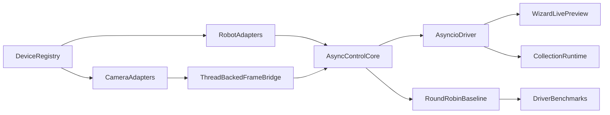

# Hybrid Async Scheduler

## Updated assumptions

- The wizard already behaves like a single synchronous loop in [/home/tb5z035i/workspace/data-collect/rollio/rollio/tui/wizard.py](/home/tb5z035i/workspace/data-collect/rollio/rollio/tui/wizard.py), especially in the robot preview stage where it repeatedly refreshes control/state inline.
- The real collection path in [/home/tb5z035i/workspace/data-collect/rollio/rollio/collect/runtime.py](/home/tb5z035i/workspace/data-collect/rollio/rollio/collect/runtime.py) currently uses one `PeriodicWorker` thread per camera, robot telemetry stream, and teleop pair.
- AIRBOT control calls in [/home/tb5z035i/workspace/data-collect/rollio/rollio/robot/airbot_play.py](/home/tb5z035i/workspace/data-collect/rollio/rollio/robot/airbot_play.py) are now assumed to be fast pybind wrappers for CAN send, and `state()` is assumed to be a fast cached read. That makes an `asyncio` robot-control loop a realistic option.
- Blocking capture remains the main problem. Camera backends still block in [/home/tb5z035i/workspace/data-collect/rollio/rollio/sensors/v4l2_camera.py](/home/tb5z035i/workspace/data-collect/rollio/rollio/sensors/v4l2_camera.py) via `cv2.VideoCapture.read()` and in [/home/tb5z035i/workspace/data-collect/rollio/rollio/sensors/realsense_camera.py](/home/tb5z035i/workspace/data-collect/rollio/rollio/sensors/realsense_camera.py) via `wait_for_frames(timeout_ms=1000)`, so cameras should be adapted behind persistent background threads instead of polled directly on the event loop.
- The current config builders in [/home/tb5z035i/workspace/data-collect/rollio/rollio/collect/runtime.py](/home/tb5z035i/workspace/data-collect/rollio/rollio/collect/runtime.py) hardcode backend types, which is the main obstacle to supporting additional robots and cameras cleanly.

```619:697:rollio/collect/runtime.py
def build_cameras_from_config(cfg: RollioConfig) -> dict[str, ImageSensor]:
    ...
    if cam_cfg.type == "pseudo":
        ...
    if cam_cfg.type == "v4l2":
        ...
    if cam_cfg.type == "realsense":
        ...

def build_robots_from_config(cfg: RollioConfig) -> dict[str, RobotArm]:
    ...
    if robot_cfg.type == "pseudo":
        ...
    if robot_cfg.type == "airbot_play":
        ...
```

## Target architecture




## Plan

1. Replace the hardcoded builders in [/home/tb5z035i/workspace/data-collect/rollio/rollio/collect/runtime.py](/home/tb5z035i/workspace/data-collect/rollio/rollio/collect/runtime.py) with capability-based registries and adapter factories. The scheduler should depend on generic interfaces such as robot control, robot telemetry, and frame source capabilities, not on concrete types like AIRBOT, RealSense, or V4L2.
2. Build a shared async control core, likely in a new module such as `/home/tb5z035i/workspace/data-collect/rollio/rollio/collect/scheduler.py`, that runs ordered cooperative tasks for:

- leader free-drive refresh
- teleop mapping and follower command send
- robot telemetry polling
- frame ingestion from async-facing camera adapters

1. Keep the robot side scheduler backend-agnostic. AIRBOT can use a native cooperative adapter because its send and state calls are fast, while future robots can provide either:

- native cooperative adapters
- thread-bridged adapters when their SDK blocks

1. Wrap blocking cameras behind persistent capture threads that expose a safe async-facing interface to the event loop. Use latest-frame or bounded-queue semantics so slow consumers do not stall teleop. This pattern should work for existing backends and future camera SDKs with callback- or polling-based APIs.
2. Keep a simple deterministic round-robin baseline using the same task objects, and add instrumentation to compare it with the `asyncio` driver under realistic teleop and preview load. Measure per-task step time, loop overruns, effective cadence, and stale-frame/drop behavior.
3. Reuse the shared architecture in both entry points:

- [/home/tb5z035i/workspace/data-collect/rollio/rollio/tui/wizard.py](/home/tb5z035i/workspace/data-collect/rollio/rollio/tui/wizard.py): use the shared async-facing scheduler in the final live preview so teleop and camera preview behave like the real runtime.
- [/home/tb5z035i/workspace/data-collect/rollio/rollio/tui/app.py](/home/tb5z035i/workspace/data-collect/rollio/rollio/tui/app.py): replace the current per-device worker construction with the shared architecture.

1. Preserve extendability as a first-class constraint. Adding a new camera or robot should only require implementing and registering an adapter plus any scanner/config wiring, without changing scheduler logic, teleop task logic, or TUI flows.

## Success criteria

- The wizard live preview can keep the leader backdrivable and the follower tracking through the same shared architecture used in collection.
- The collection runtime can run robot teleop through an `asyncio` control core without requiring one Python thread per teleop pair.
- Blocking camera backends are accessible from the async runtime through adapter bridges without blocking robot control.
- There is measurement data comparing the `asyncio` driver with a deterministic round-robin baseline before locking in the production default.
- Adding a new robot or camera backend only requires adapter and registration work, not scheduler rewrites.

