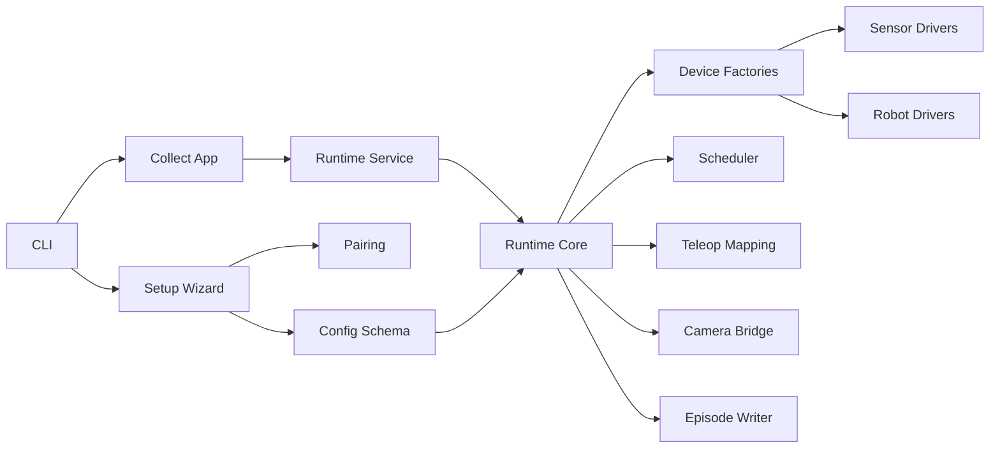
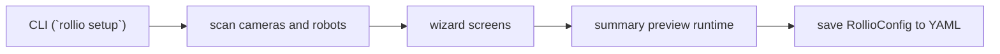
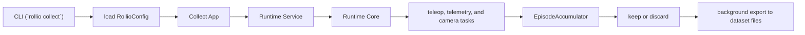
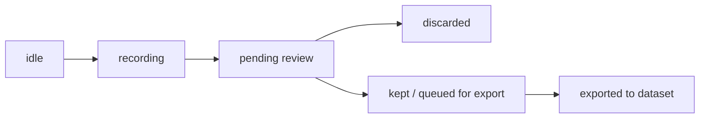

# Rollio Architecture

This document explains the system in a direct way:

1. What this repo does.
2. What the two main actions are: `rollio setup` and `rollio collect`.
3. The core concepts used in the codebase.
4. The main modules and how they relate to each other.
5. The flow over time of setup and collect.
6. The process and thread model of both actions.
7. The lifecycle of an episode.

## 1. What This Repo Does

Rollio is a Python package for collecting timestamp-aligned robot episodes.

An episode is a recorded unit of robot data that can include:

- camera frames,
- robot joint and pose state,
- teleoperation actions,
- timestamps,
- export metadata.

The main purpose of the repo is:

- discover and configure cameras and robots,
- run a live terminal-based collection application,
- record episodes from those devices,
- export the kept episodes as a LeRobot v2.1 dataset.

In short:

- `rollio setup` creates the configuration of the system,
- `rollio collect` runs the system and records data from it.

## 2. Main Actions

This document focuses on the two main user actions in the repo.

| Action | What it does | Main output |
| --- | --- | --- |
| `rollio setup` | Scans hardware, lets the user choose names and settings, validates teleop relationships, and saves a config file. | `rollio_config.yaml` |
| `rollio collect --config <path>` | Loads the config, starts the live runtime, shows previews and status in the TUI, records episodes, and exports kept episodes. | LeRobot dataset files under `storage.root/project_name/` |

The main entrypoints are:

- `rollio setup`: `CLI -> _cmd_setup() -> run_wizard()`
- `rollio collect`: `CLI -> _cmd_collect() -> run_collection()`

## 3. Core Concepts

These concepts appear repeatedly in the implementation.

| Concept | Meaning in Rollio | Main code |
| --- | --- | --- |
| `RollioConfig` | The shared configuration object. Setup creates it and collect consumes it. | `rollio.config.schema.RollioConfig` |
| Runtime | The live collection engine. It owns opened devices, periodic work, latest cached state, and current episode state. | `rollio.collect.runtime.AsyncCollectionRuntime` |
| Runtime Service | The interface used by the TUI to talk to the runtime. It hides the fact that the runtime is running in another process. | `CollectionRuntimeService`, `WorkerCollectionRuntimeService` |
| Scheduler | The component that decides when periodic work should run. It repeatedly triggers tasks such as teleop control, robot telemetry, and camera ingest. | `AsyncioDriver`, `RoundRobinDriver`, `ScheduledTask` |
| Task | One unit of periodic runtime work. Examples: `TeleopTask`, `RobotTelemetryTask`, and `CameraIngestTask`. | `rollio.collect.runtime` |
| Snapshot | A serializable summary of runtime state returned to the TUI. It contains things like latest frames, latest robot states, recording status, and export status. | `RuntimeSnapshot`, `RuntimeViewMonitor.poll_snapshot()` |
| Episode | One recording session from start to stop. It begins when recording starts, ends when recording stops, and then is either kept or discarded. | `EpisodeAccumulator`, `RecordedEpisode`, `RecordedEpisodeSummary` |

## 4. Modules And Their Relationships

### System Diagram



### Modules

The names in this table intentionally match the names in the diagram.

| Diagram name | Main files | Responsibility |
| --- | --- | --- |
| CLI | [`../rollio/cli.py`](../rollio/cli.py) | Parses commands and chooses whether to run setup or collect. |
| Setup Wizard | [`../rollio/tui/wizard.py`](../rollio/tui/wizard.py) | Runs the interactive setup flow: scan devices, edit settings, show live preview, return a config. |
| Collect App | [`../rollio/tui/app.py`](../rollio/tui/app.py) | Runs the live collection TUI: render preview, read keys, and issue commands such as start, stop, keep, and discard. |
| Config Schema | [`../rollio/config/schema.py`](../rollio/config/schema.py) | Defines `RollioConfig` and the nested config models; validates and saves YAML. |
| Pairing | [`../rollio/config/pairing.py`](../rollio/config/pairing.py) | Suggests and validates leader/follower teleop pairs. |
| Runtime Service | [`../rollio/collect/service.py`](../rollio/collect/service.py) | Worker-backed interface between the TUI and the runtime. |
| Runtime Core | [`../rollio/collect/runtime.py`](../rollio/collect/runtime.py) | Owns devices, tasks, caches, snapshots, episode state, and export submission. |
| Device Factories | [`../rollio/collect/devices.py`](../rollio/collect/devices.py) | Builds concrete camera and robot instances from config. |
| Scheduler | [`../rollio/collect/scheduler.py`](../rollio/collect/scheduler.py) | Runs periodic tasks at target intervals. |
| Teleop Mapping | [`../rollio/collect/teleop.py`](../rollio/collect/teleop.py) | Converts leader state into follower commands. |
| Camera Bridge | [`../rollio/collect/camera_bridge.py`](../rollio/collect/camera_bridge.py) | Moves blocking camera reads into dedicated threads and exposes buffered frame samples to the runtime. |
| Sensor Drivers | `../rollio/sensors/*` | Implement camera backends and camera scanning. |
| Robot Drivers | `../rollio/robot/*` | Implement robot backends, scanning, and robot-specific behavior. |
| Episode Writer | [`../rollio/episode/writer.py`](../rollio/episode/writer.py) | Writes kept episodes to Parquet, MP4, and `meta/info.json`. |

### Relationship Meanings

The arrows in the diagram mean the following:

| From | To | Meaning |
| --- | --- | --- |
| CLI | Setup Wizard | The `setup` command starts the interactive setup flow. |
| CLI | Collect App | The `collect` command starts the live collection TUI. |
| Setup Wizard | Config Schema | The wizard builds and returns validated config objects. |
| Setup Wizard | Pairing | The wizard asks pairing helpers to suggest and validate teleop pairs. |
| Collect App | Runtime Service | The TUI does not talk to devices directly; it talks through a service boundary. |
| Runtime Service | Runtime Core | The service runs the runtime in a worker process and proxies commands and snapshots. |
| Runtime Core | Device Factories | The runtime asks factories to build live camera and robot objects from config. |
| Runtime Core | Scheduler | The runtime registers periodic tasks and starts a scheduler driver. |
| Runtime Core | Teleop Mapping | Teleop tasks use mapping logic to convert leader motion into follower commands. |
| Runtime Core | Camera Bridge | Camera ingest uses thread-backed frame sources so blocking reads do not stall the scheduler. |
| Device Factories | Sensor Drivers | Camera factories choose and configure the right sensor backend. |
| Device Factories | Robot Drivers | Robot factories choose and configure the right robot backend. |
| Runtime Core | Episode Writer | Kept episodes are sent to the exporter, which uses the writer to create dataset files. |
| Config Schema | Runtime Core | The runtime is built from `RollioConfig`. |

## 5. Time Flow Of `rollio setup`

### What Setup Does

`rollio setup` turns hardware discovery plus user choices into a saved configuration file.

### Setup Flow Diagram



### Setup Flow Over Time

1. The CLI enters `_cmd_setup()` in [`../rollio/cli.py`](../rollio/cli.py).
2. It checks the output path and acquires the setup lock so two setup sessions do not run at the same time.
3. It calls `run_wizard()` in [`../rollio/tui/wizard.py`](../rollio/tui/wizard.py).
4. The wizard scans cameras and robots:
   - cameras via `scan_cameras()`,
   - robots via `scan_robots()`.
5. The wizard walks through its screens in order:
   - cameras,
   - robots,
   - project settings,
   - teleop pairs when needed,
   - summary preview.
6. Each screen produces part of the final config:
   - camera channels,
   - robot channels and roles,
   - storage and codec settings,
   - teleop pair definitions.
7. The summary screen builds a temporary `RollioConfig` and starts a live preview runtime so the user can validate the chosen devices.
8. If the user confirms, the wizard returns the final `RollioConfig`.
9. The CLI saves it as YAML with `cfg.save(...)`.

### Setup Data Flow

The setup data flow is:

`detected hardware -> user choices in wizard -> RollioConfig -> YAML file`

### Setup Process And Thread Model

Setup has two phases.

| Phase | Process / thread model | Notes |
| --- | --- | --- |
| Scan and wizard screens | Single foreground process, single TUI loop | This is the normal setup experience. Hardware is scanned directly and the user edits choices in the wizard. |
| Summary preview | Main TUI process plus a temporary runtime worker process | The final preview reuses the collection runtime. In that worker, the runtime starts the scheduler and camera threads just like collection preview does. |

The key point is:

- most of setup is simple and single-process,
- only the final live preview temporarily reuses the heavier runtime stack.

## 6. Time Flow Of `rollio collect`

### What Collect Does

`rollio collect` loads a saved config, starts the live runtime, shows current state in the terminal UI, records episodes, and exports kept episodes.

### Collect Flow Diagram



### Collect Flow Over Time

1. The CLI enters `_cmd_collect()` in [`../rollio/cli.py`](../rollio/cli.py).
2. It loads `rollio_config.yaml` with `RollioConfig.load(...)`.
3. It calls `run_collection(cfg)` in [`../rollio/tui/app.py`](../rollio/tui/app.py).
4. The collect app creates a `Runtime Service`.
5. The runtime service starts a runtime worker process.
6. Inside that worker, the `Runtime Core` is created from config:
   - cameras are built,
   - robots are built,
   - teleop pairs are resolved.
7. The runtime opens the devices, starts the scheduler, and starts the background camera sources.
8. The TUI main loop repeatedly:
   - asks for a `Snapshot`,
   - renders frames and robot state,
   - handles keys like start, stop, keep, discard, and quit.
9. When recording starts, the runtime creates an in-memory episode buffer.
10. While recording is active, periodic tasks append camera samples, robot telemetry, and teleop actions.
11. When recording stops, the episode is frozen and waits for review.
12. If the user keeps the episode, it is submitted for background export.
13. Export writes Parquet, MP4, and metadata files.
14. On shutdown, the runtime stops the scheduler, closes devices, and shuts down the exporter.

### Collect Data Flow

The collect data flow is:

`RollioConfig -> live devices -> runtime tasks -> episode buffer -> keep/discard -> background export -> dataset files`

### Collect Process And Thread Model

Collect uses more concurrency than setup because it needs to stay responsive while reading devices and exporting data.

| Execution context | Where it lives | Purpose |
| --- | --- | --- |
| Main process | `rollio.cli` and `rollio.tui.app` | Runs the terminal UI and sends high-level commands to the runtime. |
| Runtime worker process | Started by `Runtime Service` | Owns the live runtime, opened devices, cached state, and current episode. |
| Scheduler thread | Inside the runtime worker | Runs periodic tasks like teleop, telemetry, and camera ingest. |
| One camera thread per camera | Inside the runtime worker | Calls blocking `camera.read()` without blocking the scheduler. |
| Export worker process | Started by the runtime exporter | Writes kept episodes to disk in the background. |
| Export helper threads | Inside the runtime worker | Feed the export process and monitor export completion. |

Important details:

- tasks are not each given their own thread,
- teleop, telemetry, and camera ingest are scheduled in one scheduler thread,
- blocking camera I/O is moved out to per-camera threads,
- export work is moved out to a separate process so the next episode can start quickly.

## 7. Episode Lifecycle

An episode is the unit of recording.

### Episode Lifecycle Diagram



### Episode Lifecycle Steps

1. `idle`
   The runtime is live, but no episode is being recorded yet.

2. `recording`
   `start_episode()` creates an `EpisodeAccumulator`.
   From this point on, runtime tasks append data into that episode:
   - camera frames,
   - robot states,
   - teleop actions.

3. `pending review`
   `stop_episode()` freezes the in-memory episode into a completed recording and waits for the operator to choose whether to keep it.

4. `discarded`
   If the operator discards the episode, it is dropped from memory and nothing is written to disk.

5. `kept / queued for export`
   If the operator keeps the episode, it is submitted to the asynchronous exporter.
   The UI can return to idle and start another episode before export finishes.

6. `exported`
   The exporter writes the final dataset files:
   - Parquet episode table,
   - MP4 camera files,
   - dataset metadata updates.

## 8. Outputs

| Action | Output |
| --- | --- |
| `rollio setup` | One YAML config file, usually `rollio_config.yaml` |
| `rollio collect` | A LeRobot v2.1 dataset under `{storage.root}/{project_name}/` |

The dataset layout is:

```text
{root}/{project_name}/
├── meta/
│   └── info.json
├── data/
│   └── chunk-000/
│       └── episode_000000.parquet
└── videos/
    └── chunk-000/
        └── {camera_name}/
            └── episode_000000.mp4
```

## Short Summary

If you only remember three things, they are these:

- this repo is for configuring a robot data-collection system and recording timestamp-aligned episodes from it,
- `rollio setup` creates the config and `rollio collect` runs the configured system,
- the live runtime is separated from the TUI by a service boundary, with scheduler-driven tasks, camera threads, and background export.

Another good mental model is:

- setup answers: "what devices do I have and how should they be named and configured?"
- collect answers: "use that configuration to run the system and record episodes"
- an episode moves through: `idle -> recording -> pending review -> discarded` or `idle -> recording -> pending review -> kept -> exported`
